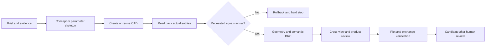

<div align="center">


# AutoCAD Skills

**Production-minded mechanical CAD skills for Codex, Claude Code, and compatible Agent Skills runners.**

[](https://github.com/beiming183-cloud/AutoCAD-skills/actions/workflows/validate.yml)
[](https://github.com/beiming183-cloud/AutoCAD-skills/releases/latest)
[](LICENSE)
[](https://code.claude.com/docs/en/skills)

[English](README.md) · [简体中文](README.zh-CN.md) · [Skill source](skills/mechanical-drafting-gbt/SKILL.md) · [Releases](https://github.com/beiming183-cloud/AutoCAD-skills/releases)

</div>

## Why this exists

AI-generated CAD can look convincing while still being wrong: endpoints nearly touch, views describe different parts, components pass through each other, a plot marked `1:1` was actually fit-to-page, or a successful tool call created the wrong coordinates.

This project turns those failure modes into explicit gates. It requires parameter authority, requested-versus-actual readback, semantic topology, cross-view proof, physical plausibility boundaries, plot-scale truth, and human release authority.

> A successful command is not a successful design review. A clean geometry DRC is not a complete product-design review.

## What it covers

| Area | Built-in expectations |
| --- | --- |
| GB/T mechanical drafting | First-angle default when unspecified, line hierarchy, dimensions, views/sections, Chinese text, title blocks, threads, gears, splines, springs, bearings |
| AutoCAD and MCP | Readiness discovery, strict typed requests, atomic staging, handle readback, `requested/actual/diff`, bounded recovery, deterministic fallback |
| 2D and 3D | Parametric parts, assemblies, mechanisms, projected views, shared 2D skeletons, section truth, exchange/re-import evidence |
| Semantic DRC/DFM | Dangling and near-miss endpoints, unintended crossings, unowned lines, open material boundaries, occlusion, view-source consistency, interference and process checks |
| Consumer products | People/scenario brief, three concept options, purchased-part envelopes, mains/moving-part safety architecture, ergonomics, cables and stability |
| Product definition | GPS/GD&T, tolerance stacks, inspection planning, BOM/configuration/revision authority, release manifests and evidence boundaries |

The current package is [`mechanical-drafting-gbt`](skills/mechanical-drafting-gbt/). Its English runtime baseline and Chinese maintenance mirror are checked together.

## Quick start

### Install with the bundled installer

```bash
git clone https://github.com/beiming183-cloud/AutoCAD-skills.git
cd AutoCAD-skills

# Codex personal skill: $CODEX_HOME/skills or ~/.codex/skills
python scripts/install_skill.py --target codex

# Claude Code personal skill: ~/.claude/skills
python scripts/install_skill.py --target claude-user
```

For a project-scoped Claude Code installation:

```bash
python scripts/install_skill.py --target claude-project --project /path/to/your/project
```

The installer refuses to overwrite an existing skill. Use `--dry-run` to inspect the destination first.

### Install directly in Codex

Ask Codex to install this repository path:

```text
Install the skill from:
https://github.com/beiming183-cloud/AutoCAD-skills/tree/main/skills/mechanical-drafting-gbt
```

Codex installs repository skills under `$CODEX_HOME/skills`. Claude Code discovers personal skills under `~/.claude/skills/` and project skills under `.claude/skills/`, as documented in the [Claude Code Skills guide](https://code.claude.com/docs/en/skills).

## Try it

After installation, ask your agent something concrete:

```text
Audit this two-view gearbox drawing. Prove both views come from the same
parameter source, classify every dangling endpoint and unintended crossing,
and verify the title-block scale against the plotted PDF.
```

```text
Create three low-cost enclosure concepts for this desktop mains-powered
product. Define users, scenarios, port count, actions and cable directions.
Do not enter detailed CAD until I select a concept and the safety architecture
and purchased-part envelopes are documented.
```

```text
Model this shaft parametrically under GB/T conventions, then generate the
drawing and inspection plan. Keep every unsupported fit, material and surface
requirement as TBD instead of guessing.
```

See the [consumer-product gate example](examples/consumer-product-review.md) and [sample DRC result](examples/drc-report.sample.json).

## The release gates



Stable checks include:

- `E_POSTCONDITION_MISMATCH`: stop when created geometry does not match the request.
- `DANGLING_ENDPOINT`, `NEAR_MISS_CONNECTION`, `INTERIOR_CROSSING`: classify topology per entity, never by a blanket explanation.
- `VIEW_SOURCE_CONSISTENCY`: principal views must share an authoritative model or parameter skeleton.
- `PLOT_SCALE_CONSISTENCY`: numeric title-block scale must match the actual PDF transform.
- `CONSUMER_CONCEPT_GATE`, `MAINS_SAFETY_GATE`, `PRODUCT_DESIGN_REVIEW`: geometry validity cannot bypass product definition and safety architecture.

## Compatibility and scope

| Runner/environment | Status | Notes |
| --- | --- | --- |
| Codex | Supported | Standard `SKILL.md`, progressive references, no account coupling |
| Claude Code | Supported | Uses the Agent Skills open format; copy to personal or project skills |
| Other Agent Skills runners | Portable baseline | Runtime-specific metadata is optional; verify local discovery rules |
| AutoCAD/MCP bridges | Capability-dependent | The skill maps to exposed safe tools and does not invent missing operations |
| CAD kernels and structured DXF tools | Supported fallback | Use only when geometry and postconditions can be independently verified |

This repository does **not** bundle AutoCAD, an MCP server, a CAD kernel, electrical certification, or automatic manufacturing approval. Agent-generated manufacturing artifacts remain `candidate after human review` until an authorized external process approves them.

## Repository layout

```text
AutoCAD-skills/
├── README.md / README.zh-CN.md
├── assets/                         # project and social-preview visuals
├── examples/                       # concrete prompts and machine-readable evidence
├── scripts/                        # installer and repository validator
├── .github/                        # CI and contribution templates
└── skills/
    └── mechanical-drafting-gbt/    # clean, portable runtime Skill package
        ├── SKILL.md
        ├── SKILL.zh-CN.md
        ├── references/
        └── scripts/
```

## Validate locally

```bash
python scripts/validate_repo.py
```

The validator checks skill frontmatter, English/Chinese mirror drift, stable rule IDs, Markdown links, JSON examples, private paths, placeholder text, and a temporary installation round trip. GitHub Actions runs the same command on every push and pull request.

## Upgrading from v1.x

The runtime skill moved from the repository root to `skills/mechanical-drafting-gbt/` in v2. Existing installed copies continue to work. For a clean update, preserve any local customization, move the old installed directory aside, and install from the new subdirectory. The installer intentionally does not overwrite existing files.

## FAQ

**Does this control AutoCAD by itself?**

No. It defines the workflow and verification contract. Actual operations depend on the AutoCAD/MCP/COM/script tools available in your environment.

**Does a passing DRC certify the drawing or product?**

No. The result is limited to the rules, representation and evidence actually evaluated. Safety, performance and manufacturing release require the applicable engineering and authorized human review.

**Why require three consumer-product concepts?**

Only new concepts and major form-factor changes require comparison. An already approved concept can be reused when its revision and decision authority are recorded.

**Can I contribute another CAD workflow or standard?**

Yes. Keep rules traceable, measurable and vendor-neutral; add English and Chinese coverage when changing mirrored core behavior.

## Contributing

Read [CONTRIBUTING.md](CONTRIBUTING.md), open a focused issue, or submit a pull request with a realistic failure case and validation evidence. Please do not submit invented standards, unverifiable manufacturing values, or checks that turn missing evidence into a pass.

If this skill prevents one plausible-looking but incorrect drawing from shipping, consider starring the repository. It helps other CAD and AI-agent users find the project.

## License

MIT. See [LICENSE](LICENSE).
