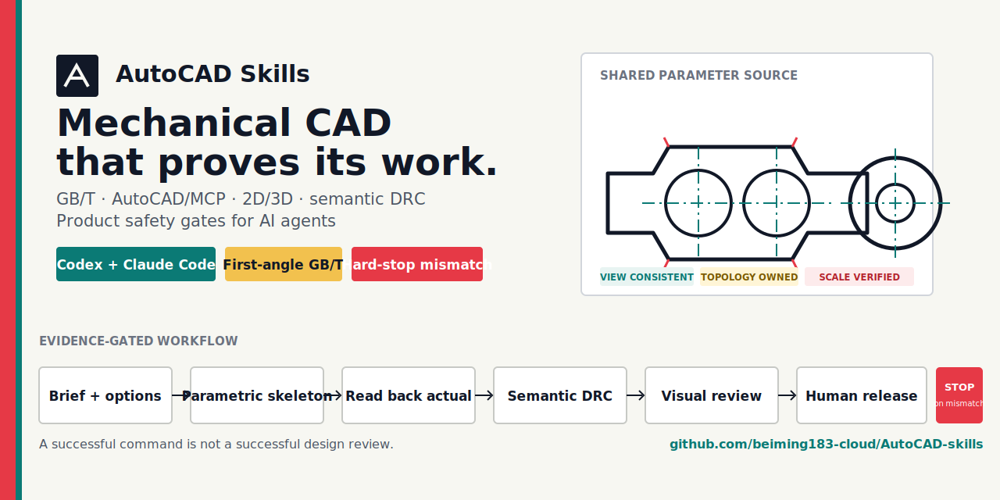
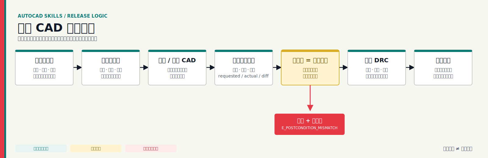

<div align="center">



# AutoCAD Skills

**面向 Codex、Claude Code 和兼容 Agent Skills 运行器的生产级机械 CAD Skills。**

[](https://github.com/beiming183-cloud/AutoCAD-skills/actions/workflows/validate.yml)
[](https://github.com/beiming183-cloud/AutoCAD-skills/releases/latest)
[](LICENSE)
[](https://code.claude.com/docs/en/skills)

[English](README.md) · [简体中文](README.zh-CN.md) · [Skill 源文件](skills/mechanical-drafting-gbt/SKILL.zh-CN.md) · [版本发布](https://github.com/beiming183-cloud/AutoCAD-skills/releases)

</div>

## 为什么需要这个项目

AI 生成的 CAD 可能看起来很像，却仍然是错的：端点差一点没有接上、两个视图描述的不是同一零件、组件互相穿透、标题栏写着 `1:1` 但 PDF 实际用了自适应，或者工具返回成功却创建了错误坐标。

本项目把这些失败模式变成明确的工程门。它要求参数权威来源、请求值与实际值回读、语义拓扑、跨视图证明、物理合理性边界、真实打印比例和外部人工发布权限。

> 工具调用成功不等于设计审查通过。几何 DRC 通过也不等于产品设计通过。

## 能做什么

| 领域 | 内置要求 |
| --- | --- |
| GB/T 机械制图 | 未指定时默认第一角画法、图线层级、尺寸、视图/剖视、中文字体、标题栏、螺纹、齿轮、花键、弹簧和轴承 |
| AutoCAD 与 MCP | 就绪发现、严格强类型请求、原子暂存、句柄回读、`requested/actual/diff`、有限恢复和确定性后端回退 |
| 二维与三维 | 参数化零件、装配体、机构、投影视图、共享二维骨架、剖切真实性及交换格式重导证据 |
| 语义 DRC/DFM | 悬空/近接端点、非预期交叉、无归属线、开放材料边界、遮挡、视图共同来源、干涉和工艺检查 |
| 消费产品 | 人群/场景简报、三种概念方案、采购件包络、市电/运动件安全架构、人体工学、线缆和稳定性 |
| 产品定义 | GPS/GD&T、尺寸链、检验规划、BOM/配置/修订权威、发布清单和证据边界 |

当前包是 [`mechanical-drafting-gbt`](skills/mechanical-drafting-gbt/)，英文运行基线和中文维护镜像会一起接受同步检查。

## 快速开始

### 使用仓库自带安装器

```bash
git clone https://github.com/beiming183-cloud/AutoCAD-skills.git
cd AutoCAD-skills

# Codex 个人 Skill：$CODEX_HOME/skills 或 ~/.codex/skills
python scripts/install_skill.py --target codex

# Claude Code 个人 Skill：~/.claude/skills
python scripts/install_skill.py --target claude-user
```

安装为 Claude Code 项目 Skill：

```bash
python scripts/install_skill.py --target claude-project --project /path/to/your/project
```

安装器不会覆盖已有 Skill。先用 `--dry-run` 可以查看目标位置。

### 在 Codex 中直接安装

让 Codex 安装以下仓库路径：

```text
请安装这个 Skill：
https://github.com/beiming183-cloud/AutoCAD-skills/tree/main/skills/mechanical-drafting-gbt
```

Codex 将仓库 Skill 安装到 `$CODEX_HOME/skills`。Claude Code 按其[官方 Skills 文档](https://code.claude.com/docs/en/skills)，从 `~/.claude/skills/` 发现个人 Skill，从 `.claude/skills/` 发现项目 Skill。

## 立即试用

安装后向 Agent 提出具体任务：

```text
审查这张双视图变速箱图。证明两个视图来自同一参数源，
逐项分类每个悬空端点和非预期交叉，并核对标题栏比例与 PDF 实际比例。
```

```text
为这个市电桌面产品生成三种低成本外壳概念。先定义人群、场景、
插口数量、操作动作和线缆方向。在我选定概念，并明确安全架构和
采购件包络前，不得进入详细 CAD。
```

```text
按 GB/T 参数化建立这根轴，随后生成工程图和检验计划。
没有依据的配合、材料和表面要求全部保持 TBD，不得猜测。
```

另见[消费产品门示例](examples/consumer-product-review.md)和[示例 DRC 结果](examples/drc-report.sample.json)。

## 发布门流程



稳定规则包括：

- `E_POSTCONDITION_MISMATCH`：创建几何与请求不一致时立即停止。
- `DANGLING_ENDPOINT`、`NEAR_MISS_CONNECTION`、`INTERIOR_CROSSING`：逐实体分类拓扑，禁止整体解释。
- `VIEW_SOURCE_CONSISTENCY`：主要视图必须来自同一权威模型或参数骨架。
- `PLOT_SCALE_CONSISTENCY`：标题栏数字比例必须与 PDF 实际变换一致。
- `CONSUMER_CONCEPT_GATE`、`MAINS_SAFETY_GATE`、`PRODUCT_DESIGN_REVIEW`：几何合法不能绕过产品定义和安全架构。

## 兼容性与边界

| 运行器/环境 | 状态 | 说明 |
| --- | --- | --- |
| Codex | 支持 | 标准 `SKILL.md`、渐进参考，不与账号绑定 |
| Claude Code | 支持 | 采用 Agent Skills 开放格式，可安装为个人或项目 Skill |
| 其他 Agent Skills 运行器 | 可移植基线 | 运行器专属元数据为可选项，应核对本地发现规则 |
| AutoCAD/MCP 桥 | 取决于能力 | Skill 只映射已暴露的安全工具，不编造不存在的操作 |
| CAD 内核与结构化 DXF 工具 | 可作为回退 | 仅在几何和后置条件可独立验证时使用 |

本仓库**不包含** AutoCAD、MCP 服务、CAD 内核、电气认证或自动制造批准。Agent 生成的制造文件在外部授权流程批准前，始终只是 `candidate after human review`。

## 仓库结构

```text
AutoCAD-skills/
├── README.md / README.zh-CN.md
├── assets/                         # 项目与社交分享视觉资源
├── examples/                       # 具体任务和机器可读证据
├── scripts/                        # 安装器与仓库校验器
├── .github/                        # CI 和社区模板
└── skills/
    └── mechanical-drafting-gbt/    # 干净、可移植的运行时 Skill 包
        ├── SKILL.md
        ├── SKILL.zh-CN.md
        ├── references/
        └── scripts/
```

## 本地验证

```bash
python scripts/validate_repo.py
```

校验器会检查 Skill frontmatter、中英镜像漂移、稳定规则 ID、Markdown 链接、JSON 示例、私有路径、占位文本和临时安装往返。GitHub Actions 会在每次 push 和 pull request 上运行同一命令。

## 从 v1.x 升级

v2 将运行时 Skill 从仓库根目录移动到 `skills/mechanical-drafting-gbt/`。现有已安装版本仍可继续使用。干净升级时请先保留本地自定义内容，把旧目录移到备份位置，再从新子目录安装；安装器不会覆盖已有文件。

## 常见问题

**它能直接控制 AutoCAD 吗？**

不能单独控制。它定义工作流与验证契约，实际操作取决于环境中可用的 AutoCAD/MCP/COM/脚本工具。

**DRC 通过是否代表图纸或产品获得认证？**

不代表。结论只覆盖实际执行的规则、表达和证据。安全、性能和制造发布仍需要适用工程验证及授权人工评审。

**为什么消费产品要先做三种方案？**

只有新概念和重大形态变化需要比较。已有批准概念在记录修订和决策权限后可以沿用。

**可以贡献其他 CAD 工作流或标准吗？**

可以。规则必须可追溯、可测量且不绑定厂商；修改双语核心行为时应同时补齐英文与中文。

## 参与贡献

阅读 [CONTRIBUTING.md](CONTRIBUTING.md)，提交范围清晰的 Issue，或带着真实失败案例和验证证据发起 Pull Request。请勿提交编造标准、无依据制造数据，或把证据缺失转成通过的检查。

如果这个 Skill 能阻止一张“看起来很像、实际上错误”的图纸进入交付，欢迎给仓库点一颗 Star，让更多 CAD 和 AI Agent 用户能找到它。

## 许可证

MIT，见 [LICENSE](LICENSE)。
